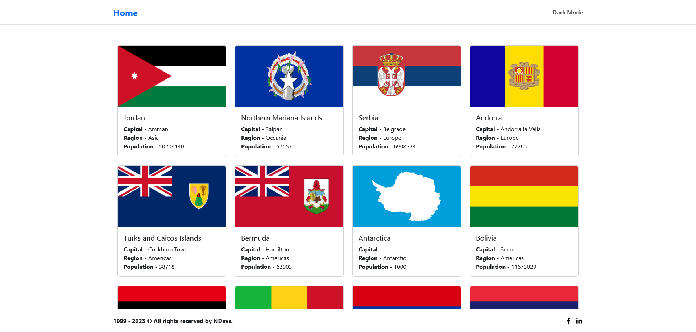

### `About This App`

The project i built is a country app that utilizes React Router DOM for dynamic routing and the REST Countries API to display data about countries around the world. The app allows users to navigate between different pages displaying information about specific countries, including their flag, population, currency, language, and more. The dynamic routing functionality enables the app to fetch data for each country based on its unique code in the API. By utilizing the REST Countries API, the app can provide accurate and up-to-date information about countries without manually inputting data. Overall, this project demonstrates your proficiency in building web applications with React and integrating external APIs to enhance functionality and user experience.

### `View Demo`

[https://react-countres-details.vercel.app/](https://react-countres-details.vercel.app/)

### `App Screen Shot`
"# Country Details" 
